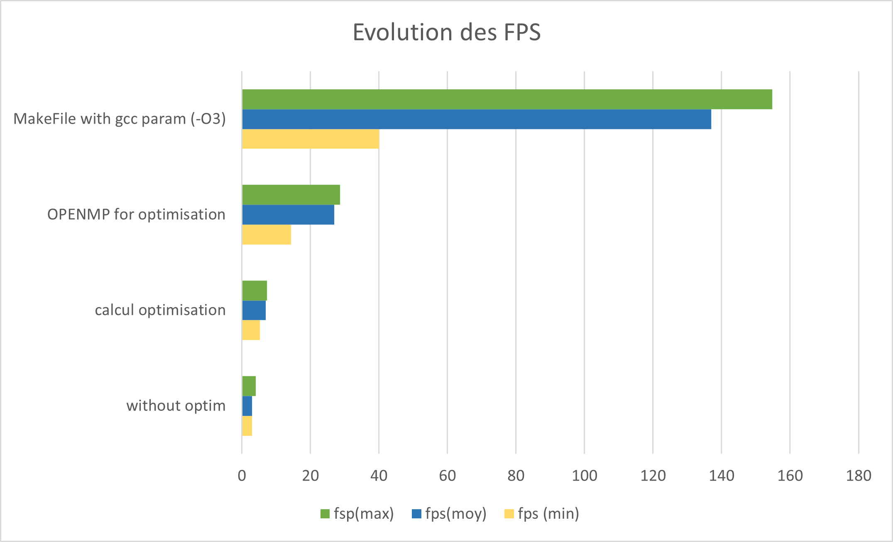

# Galaxeirb
Projet MI205
Simulation de colision de galaxy

## 1 - Sans optimisation
- Lecture du fichier dubinski.tab : OK
- Affichage des galaxies : OK
- Calcule des positions : OK

## 2 - Optimisation des calculs
- Utilisation de macro pour les puissances.
```cpp
#define Pow2(_a) (_a*_a)
#define Pow3(_a) (_a*_a*_a)
```
- Pas de répétition pour les calculs des constantes.

## 3 - Parallèlisation par OpenMP
```cpp
#pragma omp parallel for
	for (i = 0 ; i < NB_PARTICULE ; i++){
		if (colorGalaxy(i)){
			Particules[i].Galaxy = MILKYWAY;
		} else {
			Particules[i].Galaxy = ANDROMEDA;
		}
	}
```
```cpp
#pragma omp parallel for
		for ( index_loop = 0 ;  index_loop < NB_PARTICULE ; index_loop++){
			particule_calcul(index_loop);
		}
```
Ces première optimisation on permit d'augmenter le nombre de FPS, mais on vite atteint leurs limites.


## 4 - Accélération GPU