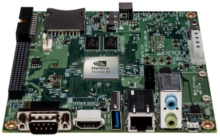
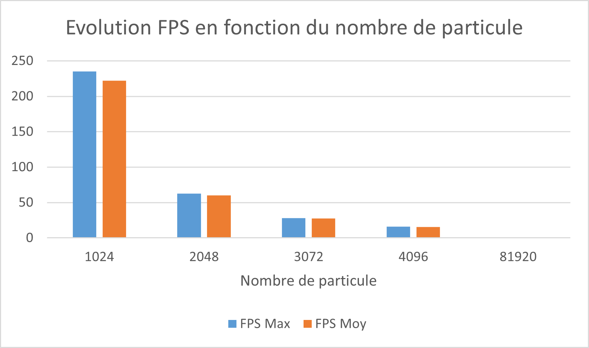

# Galaxeirb - Collision intergalactique
Projet MI205
Simulation de collision de galaxy

L'objectif de ce projet est de réaliser la simulation de la collision de deux galaxies, la nôtre la voie lactée et Andromède notre voisine la plus proche, cette collision aura lieu dans 4 milliards d'années.

Ce projet a été réaliser sur une carte de développement **NVIDIA Jetson KT1**



## 0 - Utilisation
```c
$ make all	// Compilation du projet
```
Si erreur de compilation, créée un dossier *obj* dans le dossier *CUDA* et/ou *opengl*.
Depuis le dossier *SAVARY_ALBERTY* :
```c
$ ./cuda/bin/cuda // Démarrage le projet en utilisant CUDA
```
```c
$ ./opengl/bin/opengl	// Lancement du projet en utilisant OpenMP
```
## 1 - Sans optimisation
- Lecture du fichier dubinski.tab : OK
- Affichage des galaxies : OK
- Calcule des positions : OK

## 2 - Optimisation des calculs
- Utilisation de macro pour les puissances.
```cpp
#define Pow2(_a) (_a*_a)
#define Pow3(_a) (_a*_a*_a)
```
- Pas de répétition pour les calculs des constantes.

## 3 - Parallèlisation par OpenMP
```cpp
#pragma omp parallel for
	for (i = 0 ; i < NB_PARTICULE ; i++){
		if (colorGalaxy(i)){
			Particules[i].Galaxy = MILKYWAY;
		} else {
			Particules[i].Galaxy = ANDROMEDA;
		}
	}
```
```cpp
#pragma omp parallel for
		for ( index_loop = 0 ;  index_loop < NB_PARTICULE ; index_loop++){
			particule_calcul(index_loop);
		}
```
Ces première optimisation on permit d'augmenter le nombre de FPS, mais on vite atteint leurs limites.


## 4 - Accélération GPU

